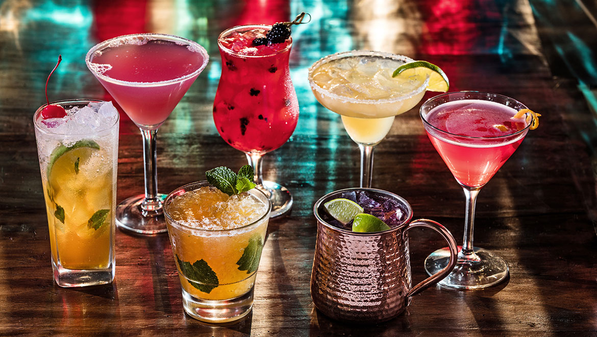

<!--  -->

---
## Abstract
In this project, I will use **Natural Language Processing (NLP)** with the data was acquired from multiple sources to build a system to recommend spirits, wine, beer, and cocktails to users based on their text inputs. The reviews, descriptions, and tasting information (wine and spirits), as well as ingredients (cocktails) were encoded using **Term Frequency–Inverse Document Frequency (TF-IDF)** and used to build **Non-negative Matrix Factorization (NMF)** topic modeling. Upon the topics extracted from the model, the cosine similarity metric is used to compare users input information and return the most relevant products.

**Please don't drink and drive!**

Please try out the [recommendation system](https://share.streamlit.io/luongtruong77/nlp-drinks-cocktails-recommender/main/app/app.py) for yourself.

---
## Design
After years of working in the hospitality and entertainment industry, I've come across several struggles that customers always face when it comes to ordering alcoholic beverages; they are:
- Choosing our favorite drink is (almost always) not easy!
- We all have different opinions and choices when choosing our favorite alcoholic drinks. How do we pick the right one out of (possibly) over 10,000 types of drinks.
- Let's say we all come to the bar to enjoy our weekends but we don't know what to order and the bartenders are too busy to recommend personalized drinks for each one of us. How do we know what we want?
- Would it be nice if we have an app (or just web brower interface) to help us choose our suitable drink based on our preference?
- **YES!** In this project, I will answer those questions with the solution for all of us who have the same questions above.

---
## Data
In order to acquire enough volume of data needed, I had to scrape from multiple sources of alcoholic beverages from the internet using [BeautifulSoup](https://beautiful-soup-4.readthedocs.io/en/latest/) and [Selenium](https://www.selenium.dev/).
- I scraped from [Tastings.com](https://www.tastings.com/Reviews/Latest-Spirits-Wine-Beer-Reviews.aspx) and [Caskers](https://www.caskers.com/spirits/). These sites are mainly for wine, spirits, and beer.


- I scraped from [Liquor](https://www.liquor.com/cocktail-by-spirit-4779438) and calling API from [CocktailDB](https://www.thecocktaildb.com/) for cocktails ingredients.


- The final ready-to-work-with dataset has around *12,000* instances and *24* features with 5 text-heavy features to work with (descriptions, reviews, tasting info, ingredients, and instructions).


---
## Tools
- Python
- Pandas
- Numpy
- Matplotlib
- Plotly
- Scikit-learn
- NLTK
- Wordcloud
- Streamlit

---
## Algorithms
The main data we use in this project is the **review** and **description** of each drink, all of which are text-heavy and will be processed using several NLP techniques.

### Data cleaning and features engineering
- Tokenize words, remove numbers and punctuations.
- Add more case-specific stop words to stop-words corpus.
- Combine short review and extended review into 1 feature Full_Review for exploring.


As we can see, before we clean the text, there are capitalized words, numbers, punctuations, and symbols. These are not helpful for us in the process. However, after we clean it, there are just lowercase words with no numbers and symbols.

### Topic modeling
**Term Frequency–Inverse Document Frequency (TF-IDF)** for encoding and **Non-negative Matrix Factorization (NMF)** for topic modeling and building recommendation system. But, what are **TF-IDF** and **NMF**? Let's take a minute and look closer into our algorithms being used in this projects.

#### What is TF-IDF and how is it used?
TF-IDF stands for term frequency-inverse document frequency. TF-IDF is a statistical measure that evaluates how relevant a word is to a document in a collection of documents. This is done by multiplying two metrics: how many times a word appears in a document, and the inverse document frequency of the word across a set of documents. Where:
```
Term Frequency (TF) = (Number of times term t appears in a document) / (Total number of terms in the document).
Inverse Document Frequency (IDF) =  log10(Total number of documents / Number of documents with term t in it).
```
In short, TF-IDF gives us a way to determine how importance of a word is in a document with respect to the document it belongs to. This step is very helpful in order to assign each data point to each relative topic in the next step: topic modeling.

#### Topic modeling with NMF.
NMF stands for Non-negative matrix factorization, also non-negative matrix approximation is a group of algorithms in multivariate analysis and linear algebra where a matrix V is factorized into (usually) two matrices W and H, with the property that all three matrices have no negative elements ([wikipedia](https://en.wikipedia.org/wiki/Non-negative_matrix_factorization)). So how does it work in our case?
After we encode our text data into numerical representation using TF-IDF,  NMF is a way to group our thousands of different drinks into a small number of subsets (say 15 categories) where all the items in each category share common aspects (flavor, ingredients, etc.)

---
## Recommendation System
### Our topics

So what are our topics? Let's look at what the common words are in each category:


Based on the common words in each topic, the full sample full description and review, as well as my domain knowledge in the industry, I have deduced the names of our 15 topics as below:


### How does the recommendation system work?

The way the recommendation system work is that it would takes an user's input as text field (it could be *flavor, ingredient, price* etc.) and then the numerical representation transformation performed by **TF-IDF**. Then **NMF** will perform matrix transformation to get vector matrix for the input text field and use that to calculate [cosine similarity](https://en.wikipedia.org/wiki/Cosine_similarity) against non-negative matrix vector of the full dataset and return the most similar products in our database.


### The recommendation system in production:


To try out the web application, the recommendation system is being deployed using [Streamlit](https://streamlit.io/) and can be accessed [here](https://share.streamlit.io/luongtruong77/nlp-drinks-cocktails-recommender/main/app/app.py)

---
